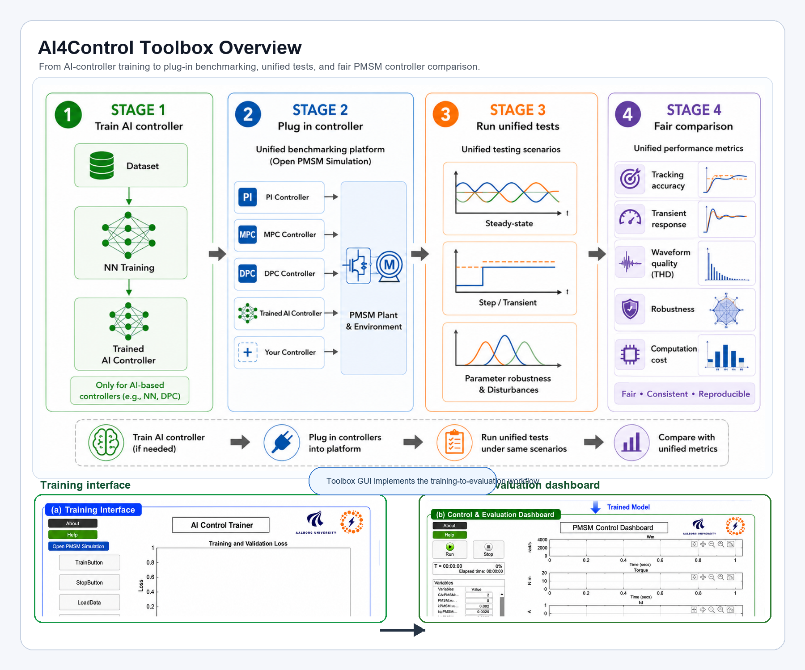

# AI-assisted Control Toolbox for Power Electronics

AI4Control is a MATLAB/Simulink toolbox for reproducible benchmarking and training of AI-assisted control methods for power electronic systems. The current release focuses on a permanent-magnet synchronous motor (PMSM) drive benchmark and compares PI, MPC, and differentiable predictive control (DPC) under a common plant, disturbance, logging, and performance-evaluation workflow.



The overview summarizes the intended training-to-evaluation workflow. AI-based controllers can first be trained from PMSM simulation data, then PI, MPC, DPC, trained AI controllers, or user-defined controllers are plugged into the same open PMSM simulation platform. All controllers are evaluated under unified steady-state, transient, disturbance, and robustness scenarios, and the results are compared using the same performance metrics.

## What the toolbox provides

- A common PMSM plant, inverter, modulation, disturbance, and logging environment.
- Controller-specific wrappers for connecting PI, MPC, DPC, and future controllers to the same benchmark interface.
- App-based training and simulation workflows through `apptrain.mlapp` and `app1.mlapp`.
- Training-data files for the PMSM learning workflow: `PMSM_dataset.mat` and `PMSM_2kW_dataset.mat`.
- Automated extraction of overshoot, settling time, current THD, robustness, and computation-speed scores.
- Radar-chart visualization for normalized comparison across control strategies.
- GUI support for data generation, neural-network training, PMSM control simulation, and metric visualization.

## Repository contents

| File | Purpose |
| --- | --- |
| `apptrain.mlapp` | AI Control Trainer app for neural-network setup, training, validation, and export. |
| `app1.mlapp` | PMSM Control Dashboard for running controller simulations and comparisons. |
| `PMSMcontrolbenchmark.slx` | Simulink PMSM benchmark model shared by all controllers. |
| `PMSM_dataset.mat`, `PMSM_2kW_dataset.mat` | Training and validation data used by the learning workflow. |
| `runComplete.m` | Batch script for running PI, MPC, and DPC benchmark simulations. |
| `calc_metrics_one_run.m` | Computes overshoot, settling time, and THD from one simulation run. |
| `draw_radar_from_workspace.m` | Builds the normalized radar-chart comparison from workspace metrics. |
| `plot_radar_wrapper.m` | Convenience wrapper that computes metrics and draws the radar chart. |
| `docs/TOOLBOX_DOCUMENTATION.md` | Detailed benchmark interface, training-data, and scoring documentation. |

## Typical workflow

1. Open MATLAB in the repository root.
2. Open `apptrain.mlapp` to configure and train the AI controller.
3. Load or generate PMSM training data from the Simulink benchmark.
4. Train and validate the neural-network controller.
5. Open `app1.mlapp` from the trainer or directly from MATLAB.
6. Run closed-loop simulations with PI, MPC, DPC, or a new controller wrapper.
7. Use `calc_metrics_one_run.m` and `draw_radar_from_workspace.m` to produce the normalized numerical and radar-chart comparison.

For a script-based comparison, run:

```matlab
runComplete([0, 1, 2])
```

where `CA = 0`, `CA = 1`, and `CA = 2` select PI, MPC, and DPC, respectively.

## Benchmark interface

The toolbox separates the common evaluation environment from controller-specific implementation. The shared layer provides measured and reference signals, the PMSM plant and inverter, disturbance profiles, signal logging, performance metrics, and benchmark timing. Individual controllers may use different internal structures, sampling logic, or coordinate frames as long as their boundary signals are adapted to the common plant interface.

See [docs/TOOLBOX_DOCUMENTATION.md](docs/TOOLBOX_DOCUMENTATION.md) for:

- signal mappings and controller-wrapper guidance;
- DPC training-data generation and offline training details;
- radar-chart normalization equations;
- robustness and computation-speed scoring;
- recommendations for adding a new controller.

## Requirements

- MATLAB R2024b or later is recommended.
- Simulink.
- Control System Toolbox.
- Deep Learning Toolbox.
- Simscape Electrical, if the installed model configuration uses Simscape Electrical components.

## Citation

If you use this toolbox in academic work, please cite:

> Y. Li et al., *AI-assisted Control Toolbox for Power Electronics*, Aalborg University, 2025.

## Contact

For questions or collaboration, contact:

- yuanli@energy.aau.dk
